# Quizzy – Cross Platform Exam System (Flutter + Firebase)

Ứng dụng thi trắc nghiệm đa nền tảng (mobile + web) xây dựng bằng Flutter, sử dụng Firebase làm backend.
Mục tiêu là giúp sinh viên làm bài kiểm tra trực tuyến, giảng viên quản lý đề thi và xem kết quả trên web.

## Features
- **Sinh viên:** Làm bài thi trắc nghiệm, xem kết quả.
- **AI Support:** Hỗ trợ sinh viên giải thích đáp án sai bằng trí tuệ nhân tạo.
- **Giảng viên:** Quản lý đề thi, ngân hàng câu hỏi và xem kết quả.
- **Super Admin:** Quản trị hệ thống.
- **Authentication:** Đăng nhập bằng tài khoản hệ thống / Google Auth.
- **System:** Realtime sync với Firebase.

---

## Screenshot Main Features

### 1. Authentication - Xác Thực
| Welcome Screen | Login | Register | Forgot Password |
|:---:|:---:|:---:|:---:|
|  |  | 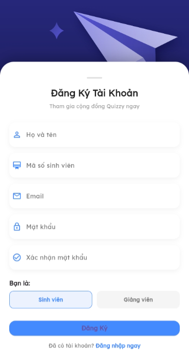 |  |

### 2. Student - Sinh Viên
| Main Screen | Profile Screen | Class List | Class Detail |
|:---:|:---:|:---:|:---:|
| 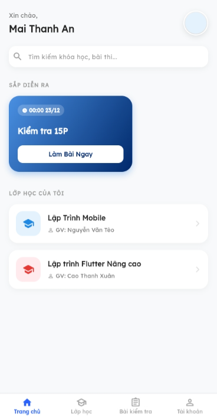 | 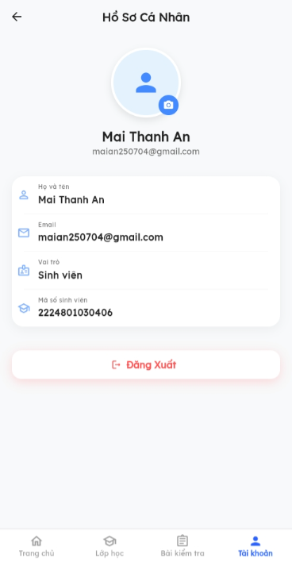 | 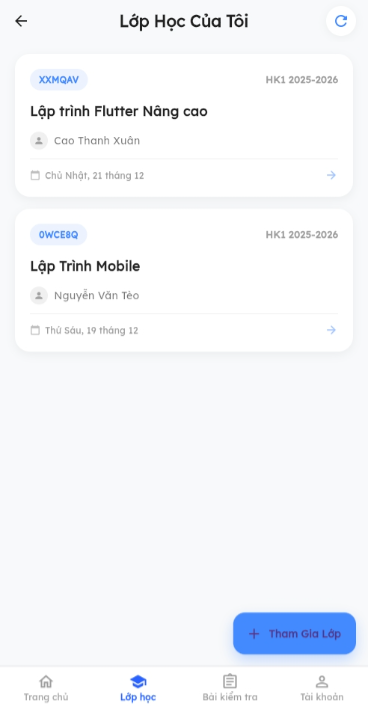 | 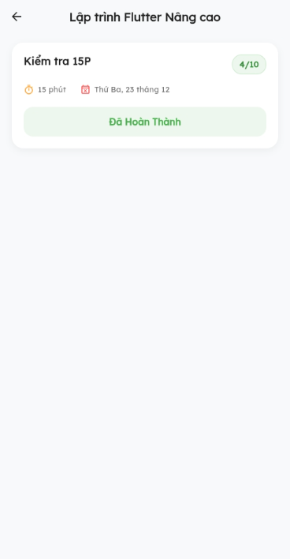 |

### 3. Lecturer - Giảng Viên
**Quản lý chung & Lớp học**
| Main Screen | Profile Screen | Class Screen | Create Class | Detail Class |
|:---:|:---:|:---:|:---:|:---:|
| 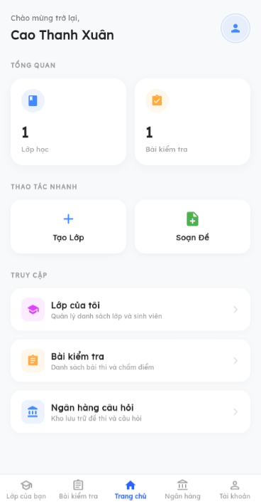 | 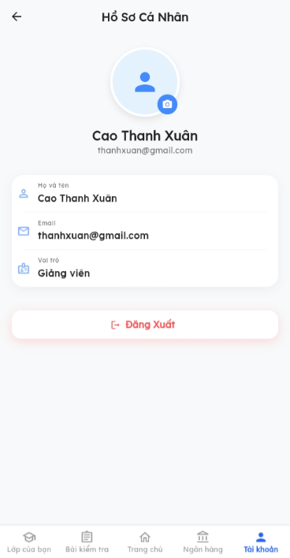 | 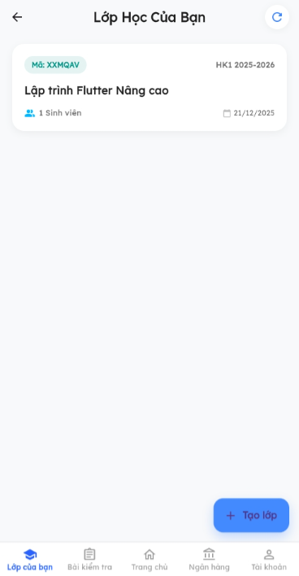 | 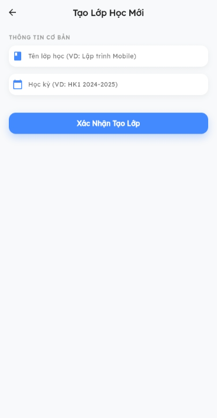 | 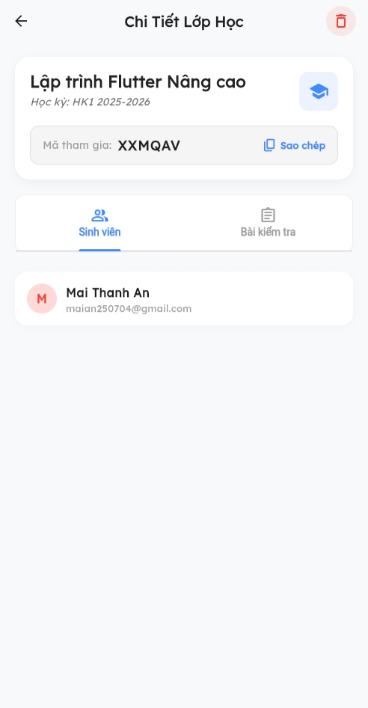 |

**Quản lý Đề thi (Quiz)**
| Detail Quiz | Config Quiz | Import From Bank | Change Status | Result |
|:---:|:---:|:---:|:---:|:---:|
| 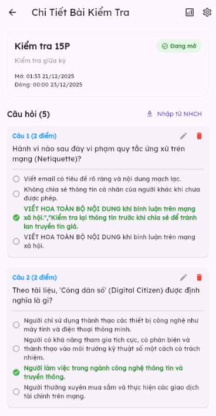 |  | 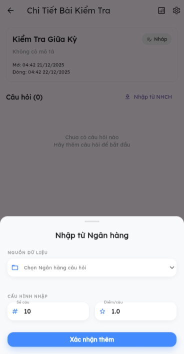 | 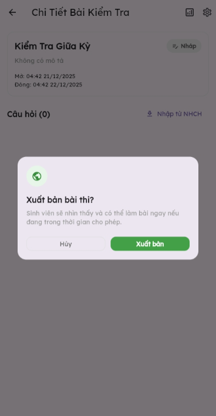 | 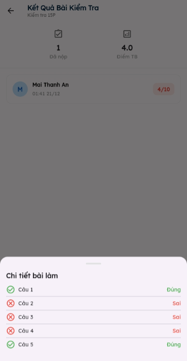 |

**Ngân hàng câu hỏi (Question Bank)**
| Bank List | Create Question | Detail Question | Add to Bank |
|:---:|:---:|:---:|:---:|
| 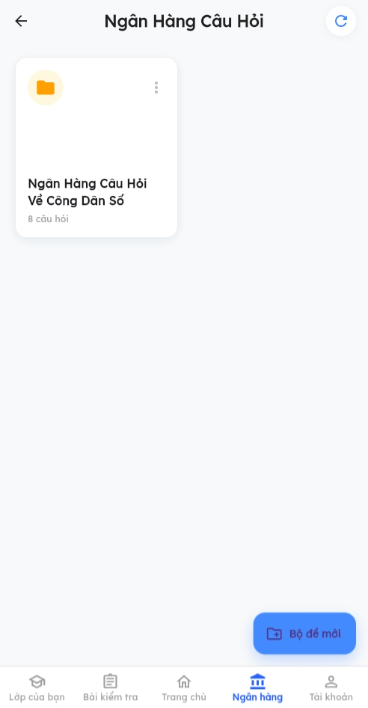 | 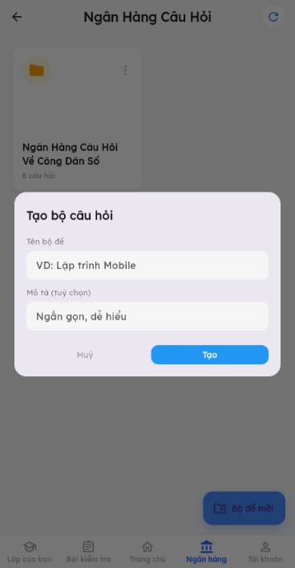 | 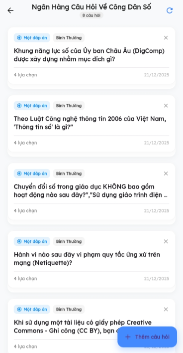 | 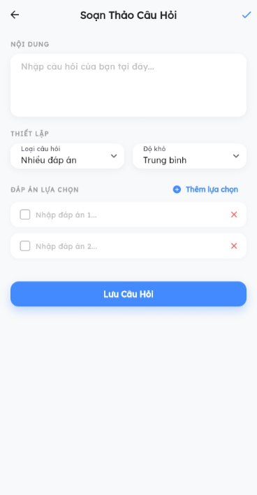 |

### 4. Admin - Quản Trị Viên
| Main Screen | Accept Request | Lock Account |
|:---:|:---:|:---:|
| 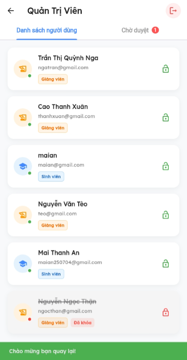 | 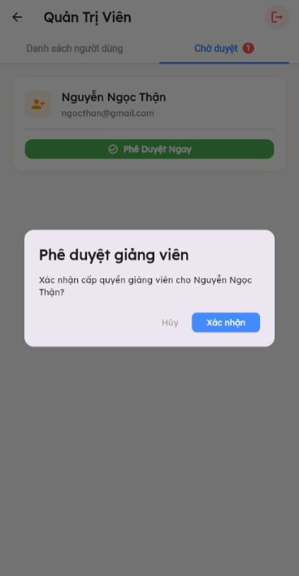 | 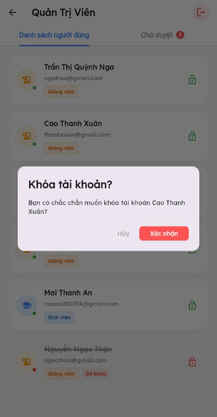 |

---

## Demo Video
Nhấn vào hình bên dưới để xem demo:

---

## Tech Stack
* **Framework:** Flutter (Dart)
* **Authentication:** Firebase Auth
* **Database:** Firebase Firestore
* **Architecture:** MVVM (Model-View-ViewModel)

## Architecture
Project được tổ chức theo kiến trúc MVVM và chia module theo tuần (sprint).

## Folder Structure
* `/docs` → Chứa tài liệu project (.md)
* `/lib` → Source code chính flutter

## Roadmap / Weekly Progress
Roadmap chi tiết được lập kế hoạch và quản lý tại Jira:
[Xem Trello Board](https://trello.com/invite/b/6909a1bbba80cacd516fbf89/ATTI17b3519fe9129702b6d4cb4813b5112aD5F83220/quizzy-cross-platform-project)

## Contact
* **Author:** Mai Thanh An
* **University:** Trường Đại Học Thủ Dầu Một
* **Academic year:** 2022 - 2027
* **Email:** [maian250704@gmail.com](mailto:maian250704@gmail.com)
